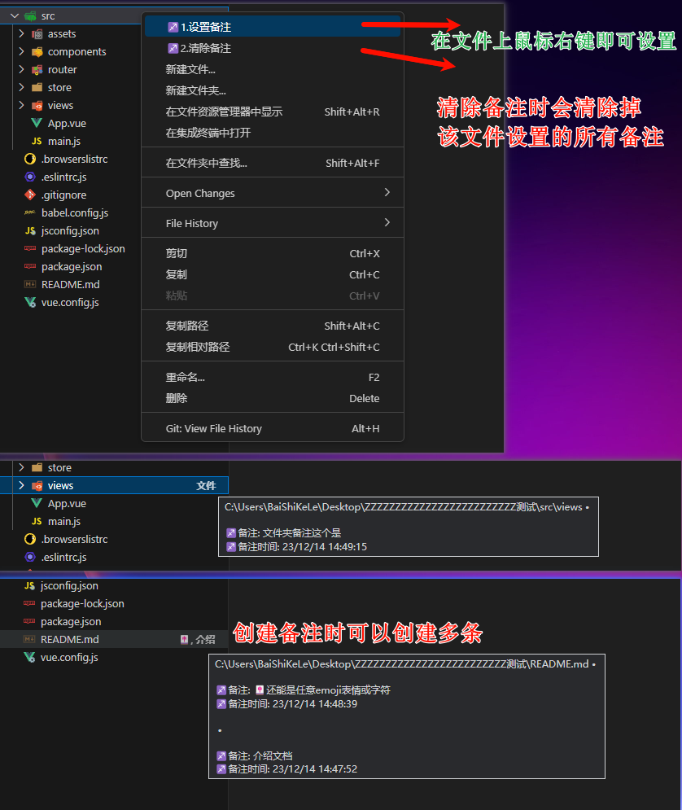

# 👻 一个给文件及文件夹设置备注的插件 👻

## 前言-（废话）

在我的日常开发中经常会遇到一些棘手的项目名称，比如【稳进提质】【浙省事】【新湘事成】这些“究极简写”及“谐音梗”。给这些文件或文件夹起名英文文件名无疑是 🤣 画上的马——顶看不顶用 😅。起拼音名，当时是能看懂了，过一段时间：“阿巴阿巴，啥呀，这是”。

也有一段时间把文件名的备注啥的以树形的结构写在 Readme.md 里面，当时看起来“嗯···挺好”，一旦有一些急事过来，临时更改或者怎么样，就会忘记更新，后面再去更新就没了头绪，理起来也很费时间，😑 费心情！😒

🎉🎉🎉 于是诞生了这个小插件 🎉🎉🎉  

## 🧧 打赏作者 🧧

#### 点击链接尽情打赏我把！https://xiaoxiaoyang.top/?donate=true  

这个也是作者的博客，里面也有很多开发的其他工具、插件推荐、干活分享、技术分享哦~
 

## 插件特点-（使用方法）

✨ 给文件及文件夹设置备注，显示在资源管理器的文件名右侧。
 ✨ 推荐在【.gitignore】文件中把【.vscode】文件夹取消忽略提交，这样在多人协同项目时，都可以看到文件备注。
 ✨ 使用方法看图

## 已知问题

- 文件夹在特定场景下备注不会显示

  Q: 如果文件夹内的文件包含未提交的文件 或其中有文件存在错误
  vscode 会提示<b>包含强调项</b>，由于该提示权限较高，无法更改，暂时没有找到理想的解决办法 
  A: 提交或修改后即可正常显示。
  

## 其他

- 备注的数据存储在/.vscode/file-notes.json 中
- 手动更改 file-notes.json 需重启 vscode 才能生效
